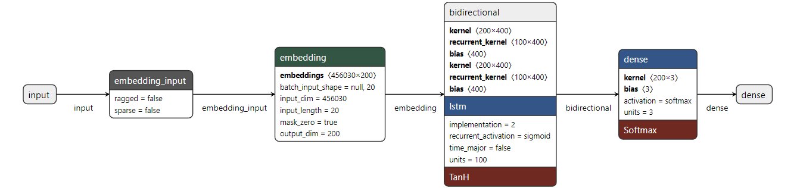
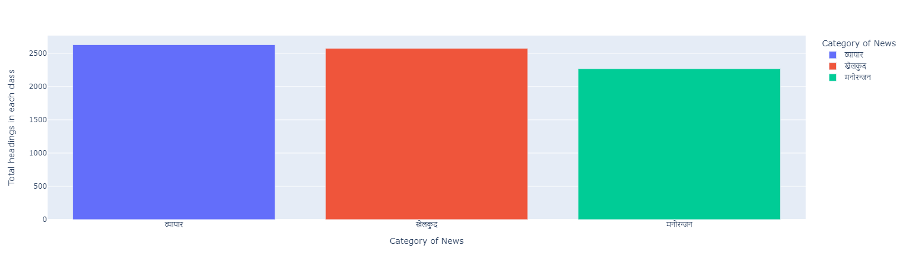
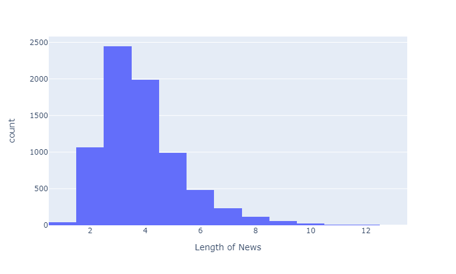
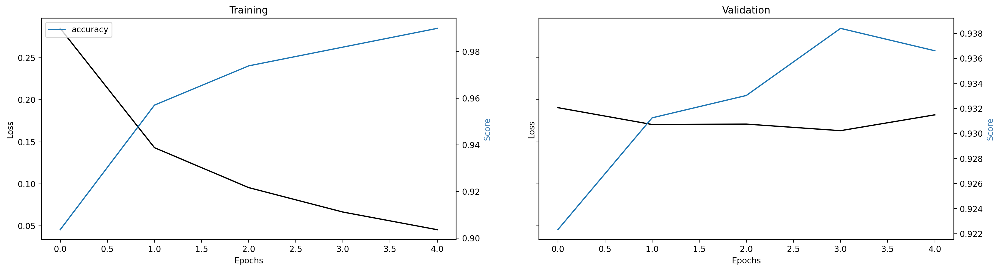
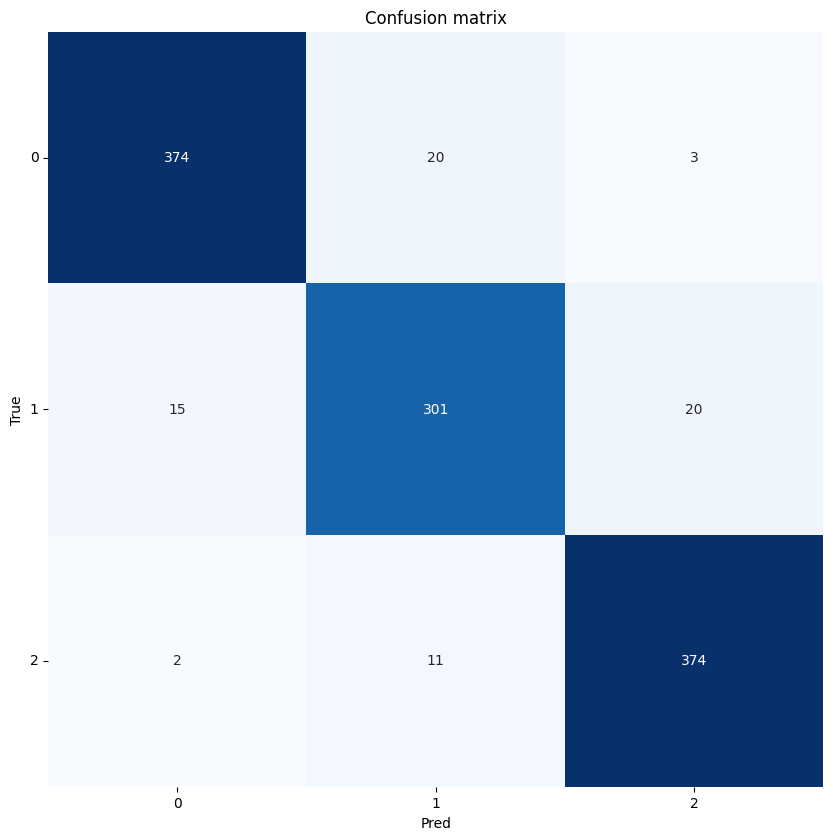

# Nepali News Classification from scratch 
### Model Architecture: 

### Download pretrained model from [HERE](https://drive.google.com/file/d/1dthVgTmM0XWj8rlZSY42qiYxWtX3jtdl/view?usp=sharing).
### For the embedding layer, we use a custom word2vec model that can be downloaded from [HERE](https://drive.google.com/file/d/1dthVgTmM0XWj8rlZSY42qiYxWtX3jtdl/view?usp=sharing). After downloading the files, extract it to ***Pretrained_wordEmbeddings*** folder. 
### To learn more about how to train your custom word2vec model, follow this [LINK](https://github.com/R4j4n/Nepali-Word2Vec-from-scratch). 

## About Dataset: 




## Some plots from training: 



## Requirements: 
```
gensim
TensorFlow
plotly
```
[](https://hits.seeyoufarm.com)


